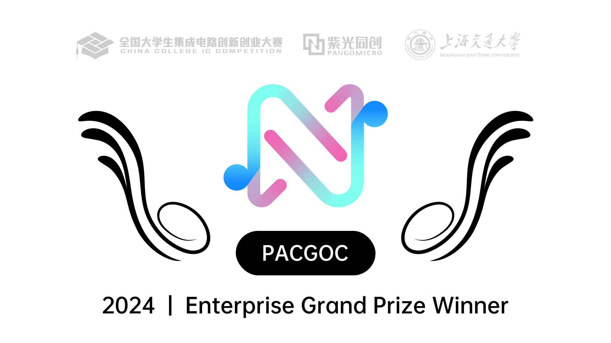
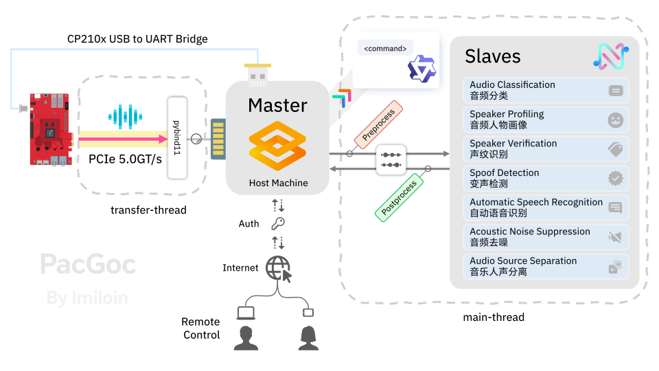

<h1 align="center">
    PacGoc: 基于紫光同创 FPGA 的音频处理系统
</h1>
<div align="center">

</img>

<br/>

<p>
<a href="https://github.com/Imiloin/PacGoc">
</img></a>
<a href="https://github.com/Imiloin/PacGoc/stargazers">
</img></a>
<a href="https://www.python.org/">
</img></a>
<a href="https://github.com/Imiloin/PacGoc?tab=GPL-3.0-1-ov-file#readme">
</img></a>
</p>

<br/>

<p>
如果本项目对您有帮助，不要忘记给它一个 ⭐️ 哦！
</p>

</div>

## Introduction

**PacGoc** 是 2024 年第八届全国大学生集成电路创新创业大赛紫光同创杯的企业大奖获奖作品。本项目包含了上位机部分（PC 端）使用的代码。

项目构建了 Python 软件包 `pacgoc`，包含以下子模块：

+ `ans`：Acoustic Noise Suppression，声学降噪模块
+ `asr`：Automatic Speech Recognition，自动语音识别模块
+ `cls`：Audio Classification，音频分类模块
+ `pcie_api`：PCIe API，PCIe 数据接收模块
+ `profiling`：Speaker Profiling，音频人物画像模块
    + `age_gender`：Age and Gender Prediction，年龄性别预测模块
    + `emotion`：Emotion Recognition，情感识别模块
+ `readwav`：Read WAV，流式读取 WAV 文件模块
+ `record`：Audio Recording，录音模块
+ `separation`：Audio Source Separation，音频源分离模块
+ `serial_api`：Serial API，串口通信模块
+ `spoof`：Spoof Detection，变声检测模块
+ `sv`：Speaker Verification，声纹识别模块
+ `utils`：Utilities，工具函数模块

项目使用 Python 语言编写。`pcie_api` 和 `serial_api` 模块须配合紫光同创盘古-50开发板（MES50HP）以及相应的硬件代码使用，其他模块可脱离开发板使用。

本项目还提供了比赛中使用的 Gradio Web 界面代码，保存在 `app` 目录下，用于统一展示项目的功能。

## What's New

+ 2024/06/25 本项目在初赛晋级 💪
+ 2024/07/28 本项目获得华东赛区分赛区决赛一等奖 🔥
+ 2024/08/21 本项目获得全国总决赛企业大奖 🏆
+ 2024/08/22 本项目在 [GitHub](https://github.com/Imiloin/PacGoc) 上开源 🎉

## Architecture

</img>

## Installation

### Environment Setup

> [!NOTE]
> 本项目的硬件配置为 Intel Core i5-12400F 处理器、16 GB 内存、NVIDIA GeForce RTX 3060 12 GB 显卡。<br/>
> 测试环境为 Ubuntu 20.04 + CUDA 11.8 + cuDNN 8.9.7 + Python 3.10 + PyTorch 2.3.0。

首先应确保安装了 [CUDA Toolkit](https://developer.nvidia.com/cuda-toolkit) 、[cuDNN](https://developer.nvidia.com/cudnn) 及相应的 Nvidia 显卡驱动。本项目的测试版本为 CUDA 11.8 + cuDNN 8.9.7，其他版本的兼容性未知。

您可能还需要安装一些依赖库：

```bash
sudo apt update && sudo apt upgrade
sudo apt install ffmpeg libsndfile1 pulseaudio dbus
```

如果您想快速复现比赛中使用的项目，在上述环境依赖部署完毕后，可以直接查看[使用整合包的方法](#use-the-integration-package)，跳过下面的安装步骤。

### Install pacgoc package

安装 [Anaconda](https://www.anaconda.com/download) 或 [Miniconda](https://docs.anaconda.com/miniconda/)，便于环境配置。

创建一个新的 python 3.10 conda 环境并激活：

```bash
conda create -n pacgoc python=3.10
conda activate pacgoc
```

访问 [PyTorch 官网](https://pytorch.org/get-started/locally/) 获取适合系统和 CUDA 版本的 PyTorch 安装命令。本项目的测试版本为 PyTorch 2.3.0，理论上高于 2.1.0 的版本均可。一个示例命令如下：

```bash
# change the CUDA version to the one you have
pip install torch torchvision torchaudio --index-url https://download.pytorch.org/whl/cu118
# or specify the version
pip install torch==2.3.0 torchvision==0.18.0 torchaudio==2.3.0 --index-url https://download.pytorch.org/whl/cu118
```

安装其他依赖：

```bash
pip install -r requirements.txt
```

克隆本仓库：

```bash
git clone https://github.com/Imiloin/PacGoc.git
cd PacGoc
```

安装 `pacgoc` 包：

```bash
pip install -e .
# alternatively, install the latest commit from this repository
# pip install --upgrade --no-deps --force-reinstall git+https://github.com/Imiloin/PacGoc.git
```

### Installation for webui

在已有的环境下安装 Gradio：

```bash
# conda activate pacgoc
pip install -r requirements_app.txt
```

由于 [Gradio 的 issue #8160](https://github.com/gradio-app/gradio/issues/8160)，本项目使用的是 Gradio 4.16.0 版本。在此 issue 解决前，不建议使用较新的版本。<br/>
Update: Gradio 5.0 已经发布，修复了此问题。

## Usage

### Use the pacgoc package

#### 硬件接口模块

硬件接口模块需要配合相应的开发板和硬件程序使用。

##### PCIe 接口

在 FPGA 端，音频数据通过 PMOD 接收为单通道 48000 Hz 采样率的 int16 PCM 格式，并整理为数据包的格式通过 PCIe 发送到 PC 端。在 PC 端，从 PCIe 接口接收数据包，解析音频数据。

数据包为 8 个包头数据 + 128 个音频数据的格式，有效包头数据设置为 0xAAAA，相关设置可以在 `pango_pcie/includes/audio.h` 中查看和修改。若收到的数据包没有有效包头，则认定为无效数据包。数据包的发送方式请查看硬件部分的代码。

项目使用了 pybind11 封装了 PCIe 接口，可以在 Python 中调用，将音频数据直接读取为 `numpy.ndarray` 格式。相关的 C 代码保存在 `pango_pcie/` 目录下，需要进行编译并移动编译得到的 `so` 文件到 `pacgoc/pcie_api` 目录下。

```bash
conda activate pacgoc  # activate the previously created environment
cd pango_pcie && ./run.sh && cd ..
```

每次重启上位机后，需要重新装载 PCIe 驱动程序：

```bash
cd driver && sudo ./run.sh && cd ..
```

在 Python 中，即可使用 `pacgoc.pcie_api` 模块调用 PCIe 接口。

```python
import os
import wave
import numpy as np
import threading
import time
from pacgoc.pcie_api import PCIe


def write_wav(data: np.ndarray, frame_rate: int, file_path: os.PathLike):
    os.makedirs(os.path.dirname(file_path), exist_ok=True)
    # pls make sure data is int16
    data = data.astype(np.int16)

    with wave.open(file_path, "w") as wav_file:
        n_channels = 1  # single channel
        sample_width = 2  # int16
        n_frames = len(data)

        wav_file.setnchannels(n_channels)
        wav_file.setsampwidth(sample_width)
        wav_file.setframerate(frame_rate)
        wav_file.setnframes(n_frames)

        # write data to file
        wav_file.writeframes(data.tobytes())


# create PCIe receiving thread
source = PCIe()
th_receive = threading.Thread(target=source.receive, daemon=True)
th_receive.start()

# wait some time for receiving data
time.sleep(10)

# get data from PCIe buffer
print(source.get_queue_size())
audio_data = source.get_queue_data()

# save audio data to WAV file
write_wav(audio_data, 48000, "received.wav")

# stop receiving thread
source.stop()
th_receive.join()
```

将上述代码保存为 `test_pcie.py` 并运行，即可接收 PCIe 发送的音频数据并保存为 WAV 文件。凡是涉及到 PCIe 操作，由于驱动原因需要使用 sudo 运行并将用户权限安装的 conda 环境的 bin 目录添加到 PATH 环境变量中。

```bash
# conda activate pacgoc
sudo env "PATH=$CONDA_PREFIX/bin:$PATH" python test_pcie.py
```

##### 串口接口

串口部分主要使用了 `pyserial` 库，可以在 Python 中调用串口接口。

如果没有特殊需要，可以直接使用 `pyserial` 库进行串口通信。本项目对串口进行了简单的封装，可以在 `pacgoc.serial_api` 模块中调用。

在硬件部分，设置了部分特殊指令，通过串口向 FPGA 发送指令，FPGA 会执行特定功能并返回成功或失败信息。具体内容请查看硬件部分的代码。

```python
from pacgoc.serial_api import Serial


def send_command(command: str, max_retries: int = 3, timeout: float = 0.5) -> bool:
    global serial
    for _ in range(max_retries):
        serial.write(command)
        response = serial.read(timeout=timeout)
        if response == "\x00":
            return True
    return False

serial = Serial(
    baudrate=115200,
    bytesize=8,
    parity="E",  # even
    stopbits=1,
)

state = send_command("TU")
if not state:
    print("Failed.")
```

#### 音频分析&处理模块

`pacgoc` 包的功能模块均提供了 `__call__` 方法，支持输入 `float32` 或 `int16` 类型的 `numpy.ndarray` 格式数据。

对于 WAV 音频文件，可以使用 `librosa` 或 `torchaudio` 库读取为 \[-1, 1\) 的 `float32` 格式 `numpy.ndarray` ：

```python
audio_file = "<path_to_wav_file>"  # should be a mono wav file

# use librosa
import librosa

audio, sr = librosa.load(audio_file, sr=None)

# or use torchaudio
import torchaudio

audio, sr = torchaudio.load(audio_file)
```

待读取的 WAV 音频数据应为单声道（mono）格式，同时采样率最好大于或等于 16 kHz。可以使用 `ffmpeg` 工具将音频文件转换为符合要求的格式：

```bash
ffmpeg -i input.mp3 -ac 1 -ar 16000 output.wav
```

##### 音频分类

<details><summary>Click to Expand</summary>

```python
from pacgoc.cls import CLS


cls_model_root = "<path_to>/ced-base"

cls = CLS(
    sr=sr,
    isint16=False,
    model_root=cls_model_root,
    topk=3,
)

res = cls(audio)
print(res)
```

`cls_model_root` 为音频分类模型的根目录，可从 [Hugging Face](https://huggingface.co/mispeech/ced-base) 下载。

```text
ced-base/
├── README.md
├── config.json
├── model.safetensors
└── preprocessor_config.json
```

</details>

##### 音频人物画像

<details><summary>Click to Expand</summary>

```python
from pacgoc.profiling import AgeGender
from pacgoc.profiling import Emotion


age_gender_model_root = "<path_to>/wav2vec2-large-robust-24-ft-age-gender"
emotion_model_root = "<path_to>/emotion2vec_plus_large"

age_gender = AgeGender(
    sr=sr,
    isint16=False,
    model_root=age_gender_model_root,
)
emotion = Emotion(
    sr=sr,
    isint16=False,
    model_root=emotion_model_root,
)

agegender_res = age_gender(audio_data)
print(agegender_res)
emotion_res = emotion(audio_data)
print(emotion_res)
```

`age_gender_model_root` 为年龄性别预测模型的根目录，可从 [Hugging Face](https://huggingface.co/audeering/wav2vec2-large-robust-24-ft-age-gender) 下载。`emotion_model_root` 为情感识别模型的根目录，可从 [Hugging Face](https://huggingface.co/emotion2vec/emotion2vec_plus_large) 下载。

```text
wav2vec2-large-robust-24-ft-age-gender/
├── config.json
├── model.safetensors
├── preprocessor_config.json
└── vocab.json

emotion2vec_plus_large/
├── README.md
├── config.yaml
├── configuration.json
├── emotion2vec+data.png
├── emotion2vec+radar.png
├── logo.png
├── model.pt
└── tokens.txt
```

</details>

##### 声纹识别

<details><summary>Click to Expand</summary>

```python
from pacgoc.sv import Vector


sv_model_root = "<path_to>/speech_eres2netv2w24s4ep4_sv_zh-cn_16k-common"
enroll_embeddings_json = "<path_to_enroll_embeddings_json>"
enroll_audio_dir = "<path_to_enroll_audio_dir>"

vector = Vector(
    sr=sr,
    isint16=False,
    model_root=sv_model_root,
    threshold=0.6,
    enroll_embeddings=enroll_embeddings_json,
    enroll_audio_dir=enroll_audio_dir,
)

res = vector(audio)
print(res)
```

`sv_model_root` 为声纹识别模型的根目录，可从 [ModelScope](https://modelscope.cn/models/iic/speech_eres2netv2w24s4ep4_sv_zh-cn_16k-common) 下载。

```text
speech_eres2netv2w24s4ep4_sv_zh-cn_16k-common/
├── README.md
├── configuration.json
├── images
│   ├── ERes2NetV2.png
│   └── ding.png
└── pretrained_eres2netv2w24s4ep4.ckpt
```

关于其他参数，`threshold` 为声纹识别的阈值，应为 0 到 1 之间的浮点数。

`enroll_embeddings` 为注册的声纹特征向量保存得到的 JSON 文件，`enroll_audio_dir` 为注册的音频文件目录（应保存一个或多个采样率为 16 kHz 的单声道 WAV 音频文件）。

+ 若二者同时指定，将为 `enroll_audio_dir` 中的每一个音频文件生成特征向量，并保存在指定的 `enroll_embeddings` 中存储为 JSON 文件，音频文件的文件名将作为键，特征向量作为值。
+ 当仅指定 `enroll_audio_dir` 时，将为 `enroll_audio_dir` 中的每一个音频文件生成特征向量，调用时直接使用这些特征向量进行声纹识别，不进行保存。
+ 当仅指定 `enroll_embeddings` 时，调用时将读取其中的特征向量进行声纹识别。

</details>

##### 变声检测

<details><summary>Click to Expand</summary>

```python
from pacgoc.spoof import SpoofDetector


spoof_model_root = "<path_to>/spoof_detection"

spoof_detector = SpoofDetector(
    sr=sr,
    isint16=False,
    model_root=spoof_model_root,
)

res = spoof_detector(audio)
print(res)
```

`spoof_model_root` 为变声检测模型的顶层目录。为了满足赛题要求，变声检测使用了自行微调的 DistilHuBERT 模型，基于硬件部分的变声工具制作数据集。模型的微调方法可以参考 [Hugging Face 的 Audio Course](https://huggingface.co/learn/audio-course/chapter4/fine-tuning#fine-tuning-a-model-for-music-classification)。如果需要，您可以在[夸克网盘](https://pan.quark.cn/s/3c9fecd7b7be)（提取码：di8W）下载本项目使用的预训练模型，也可以尝试自行微调。

```text
spoof_detection/
├── fine-tuned
│   ├── config.json
│   ├── model.safetensors
│   ├── preprocessor_config.json
│   └── training_args.bin
└── pre-trained
    ├── config.json
    ├── model.safetensors
    └── preprocessor_config.json
```

</details>

##### 自动语音识别

<details><summary>Click to Expand</summary>

```python
from pacgoc.asr import ASR


asr_model_root = "<path_to>/SenseVoiceSmall"

asr = ASR(
    sr=sr,
    isint16=False,
    model_root=asr_model_root,
)

res = asr(audio)
print(res)
```

`asr_model_root` 为自动语音识别模型的根目录，可从 [Hugging Face](https://huggingface.co/FunAudioLLM/SenseVoiceSmall) 下载。

```text
SenseVoiceSmall/
├── README.md
├── am.mvn
├── chn_jpn_yue_eng_ko_spectok.bpe.model
├── config.yaml
├── configuration.json
└── model.pt
```

</details>

##### 音频去噪

<details><summary>Click to Expand</summary>

```python
from pacgoc.ans import ANS


ans_model_root = "<path_to>/speech_frcrn_ans_cirm_16k"
output_dir = "<path_to_output_dir>"
output_filename = "denoised.wav"

ans = ANS(
    sr=sr,
    isint16=False,
    model_root=ans_model_root,
    output_path=output_dir,
    output_filename=output_filename,
)

ans(audio)
```

`ans_model_root` 为音频去噪模型的根目录，可从 [ModelScope](https://modelscope.cn/models/iic/speech_frcrn_ans_cirm_16k) 下载。

```text
speech_frcrn_ans_cirm_16k/
├── README.md
├── configuration.json
├── description
│   ├── matrix.png
│   └── model.png
├── faq.md
└── pytorch_model.bin
```

关于其他参数，`output_path` 为去噪后的音频文件保存目录，`output_filename` 为去噪后的音频文件名。

</details>

##### 音频源分离

<details><summary>Click to Expand</summary>

```python
from pacgoc.separation import SourceSeparation


query_folder = "<path_to_query_folder>"
query_sr = 16000
ckpt = "<path_to>/zeroshot_asp_full.ckpt"
resume_ckpt = "<path_to>/htsat_audioset_2048d.ckpt"
output_dir = "<path_to_output_dir>"
output_filename = "separated.wav"

separation = SourceSeparation(
    sr=sr,
    query_sr=query_sr,
    isint16=False,
    ckpt=ckpt,
    resume_ckpt=resume_ckpt,
    query_folder=query_folder,
    output_path=output_dir,
    output_filename=output_filename,
)

separation(audio)
```

`ckpt` 为音频源分离模型的检查点文件，`resume_ckpt` 为声音事件检测系统的检查点文件，可从 [GitHub](https://github.com/RetroCirce/Zero_Shot_Audio_Source_Separation) 下载。

+ `query_folder`: 音频源分离的 query 音频文件目录，应包含一个或多个采样率相同的单声道 WAV 音频文件。
+ `query_sr`: 音频源分离的 query 音频文件采样率。
+ `output_path`: 音频源分离后的音频文件保存目录。
+ `output_filename`: 音频源分离后的音频文件名。

</details>

### Use the Gradio app

> [!NOTE]  
> 如果完全启用所有功能，需要约 10 GB 的显存，请注意您的硬件配置。

#### 首次运行

首次运行时，您可能需要修改 app 的运行配置。将 `app/config.py` 复制到 `app/config_user.py`，并根据需要修改 `config_user.py` 中的参数。

```bash
cp -i app/config.py app/config_user.py
# sudo chmod 777 app/config_user.py  # if necessary
```

下面对 `config_user.py` 中的部分参数进行介绍。其余的参数参照[音频分析&处理模块](#音频分析处理模块)一节应当容易理解其含义，此处不再赘述。

##### ON/OFF

> [!IMPORTANT]  
> 如果您没有连接相应的 FPGA 开发版或没有使用配套的硬件代码，应将 `HARDWARE_CONTROLLER_ON` 设置为 `False`。

+ `HARDWARE_CONTROLLER_ON`：是否启用硬件控制器（使用串口向 FPGA 发送指令）。
+ `AUDIO_CLASSIFICATION_ON`：是否启用音频分类功能。
+ `SPEAKER_PROFILING_ON`：是否启用音频人物画像功能。
+ `SPEAKER_VERIFICATION_ON`：是否启用声纹识别功能。
+ `SPOOF_DETECTION_ON`：是否启用变声检测功能。
+ `AUTOMATIC_SPEECH_RECOGNITION_ON`：是否启用自动语音识别功能。
+ `ACOUSTIC_NOISE_SUPPRESSION_ON`：是否启用声学降噪功能。
+ `AUDIO_SOURCE_SEPARATION_ON`：是否启用音频源分离功能。
+ `LLM_CHAT_ON`：是否启用 LLM 聊天功能。

> [!TIP]
> 在 App 中，本项目在本地部署了一个 [Qwen2-1.5B-Instruct](https://huggingface.co/Qwen/Qwen2-1.5B-Instruct) 语言模型（图一乐），通过 System Prompt + Custom Logits Processor 的方式实现了简单的 LLM 执行指令功能。启用该功能会有较大的显存占用。

##### Recordings

`recordings_dir`：录音文件存放目录。

##### App

+ `share`：是否启用 Gradio 的分享功能，默认关闭。启用后会生成共享链接（显示在控制台中），打开链接时需要输入用户名和密码。首次启用时可能出现无法下载 `frpc_linux_amd64_v0.2` 的报错，请尝试切换网络环境。
+ `INTERVAL`：启动时默认的识别间隔，单位为秒。打开 App 后，默认会每隔 `INTERVAL` 秒运行一次已 Enable 的功能。该数值在 App 中也可以通过滑块调整。
+ `MAX_AUDIO_LEN`：最大音频时长，单位为秒。用 `Start Listening` 手动指定识别的音频片段时，超过此时长后会自动运行 `End Listening`。

#### 启动 App

激活 [Installation](#installation) 一节中创建的环境：

```bash
conda activate pacgoc
```

如果启用了 PCIe 功能，需要装载 PCIe 驱动程序：

```bash
cd driver && sudo ./run.sh && cd ..
```

启动 Gradio App：

```bash
## choose the source you want to use ##

# use PCIe source
sudo env "PATH=$CONDA_PREFIX/bin:$PATH" python app/app.py --source pcie

# use speaker output as source
python app/app.py --source speaker
# if you encounter AssertionError error, try the following command
# env "XDG_RUNTIME_DIR=/run/user/1000" "PULSE_RUNTIME_PATH=/run/user/1000/pulse/" python app/app.py --source speaker

# use WAV file as source
python app/app.py --source "/path/to/file.wav"
```

可以指定音频源，默认将 PCIe 接收的音频数据作为输入（需要使用 sudo）。如果没有连接相应的 FPGA 开发版或没有使用配套的硬件代码，也可以将电脑的输出音频（扬声器）作为输入或使用 WAV 音频文件模拟流式输入。

## Use the integration package

您可以从[百度网盘](https://pan.baidu.com/s/1ojf-7e-r-iW3LrQEXi_jOg)（提取码：zdk4）下载本项目的整合包，在[环境依赖部署](#environment-setup)完成后可以解压即用。

解压整合包：

```bash
cat pacgoc-integration-package.tar.part-* > pacgoc-integration-package.tar
tar -xvf pacgoc-integration-package.tar
cd PacGoc
```

> [!WARNING]
> 整合包预装的 PyTorch 对应的 CUDA 版本为 11.8。如果您的 CUDA 版本不同，可能需要重新安装 PyTorch。<br/>
> 使用 `source "pacgoc_env/bin/activate"` 激活整合包环境，然后访问 [PyTorch 官网](https://pytorch.org/get-started/locally/) 获取相应 CUDA 版本的 PyTorch 安装命令并执行。

运行启动脚本：

```bash
chmod a+x go-integration-package.sh
sudo ./go-integration-package.sh pcie
```

如果没有连接相应的 FPGA 开发版或没有使用配套的硬件代码，类似于[启动 App](#启动-app)一节，可以使用其他音频源：

```bash
# use speaker output as source
sudo ./go-integration-package.sh speaker
# use WAV file as source
sudo ./go-integration-package.sh "/path/to/file.wav"
```

## FAQ

### 硬件部分的代码在哪？

本项目仅包含上位机部分的软件代码。硬件代码主要由 [@hosionn](https://github.com/hosionn) 负责，开源计划待定。

### 能在 Windows 上运行吗？

PCIe 模块使用了 Linux 版本的驱动，无法在 Windows 上使用。串口模块在安装 [Windows 驱动](https://www.silabs.com/developers/usb-to-uart-bridge-vcp-drivers?tab=downloads)后应当可以使用。除此以外，`pacgoc` 包中的其他功能理论上可以在 Windows 上使用，但未经过详细的测试。

Gradio App 在关闭 `HARDWARE_CONTROLLER_ON` 选项后并指定音频源为系统输出音频或 WAV 文件时理论上可以在 Windows 上运行，但未经过详细的测试。

### Logo 有什么设计内涵？

Logo 整体为字母 “N” 的形状，与紫光同创标识相呼应。整体使用渐变色设计，优雅灵动，也具有创新活力。两侧伸出的圆形与内部线条构成音符的形状，代表了本项目音频处理的功能。

## Credits

> “If I have seen further, it is by standing on the shoulders of giants.”
> <div align="right">— Issac Newton</div>

本项目使用了 [pybind11](https://github.com/pybind/pybind11) 完成了 PCIe 接口在 Python 中的调用，感谢 pybind11 的作者和贡献者。

本项目使用 [Gradio](https://gradio.app/) 轻松完成了 UI 界面，感谢 Gradio 的作者和贡献者。

本项目使用了很多软件包提供的 API，极大节省了开发时间。在此向这些项目的作者和贡献者表示感谢（排名不分先后）：

+ [ModelScope](https://github.com/modelscope/modelscope)
+ [FunASR](https://github.com/modelscope/FunASR)
+ [Transformers](https://github.com/huggingface/transformers)

本项目还使用了很多开源项目提供的预训练模型，感谢这些项目的作者和贡献者（排名不分先后）：

+ [speech_frcrn_ans_cirm_16k](https://modelscope.cn/models/iic/speech_frcrn_ans_cirm_16k)
+ [SenseVoiceSmall](https://huggingface.co/FunAudioLLM/SenseVoiceSmall)
+ [ced-base](https://huggingface.co/mispeech/ced-base)
+ [wav2vec2-large-robust-24-ft-age-gender](https://huggingface.co/audeering/wav2vec2-large-robust-24-ft-age-gender)
+ [emotion2vec+large](https://huggingface.co/emotion2vec/emotion2vec_plus_large)
+ [zeroshot_asp_full](https://github.com/RetroCirce/Zero_Shot_Audio_Source_Separation)
+ [distilhubert](https://huggingface.co/ntu-spml/distilhubert)
+ [speech_eres2netv2w24s4ep4_sv_zh-cn_16k-common](https://modelscope.cn/models/iic/speech_eres2netv2w24s4ep4_sv_zh-cn_16k-common)
+ [Qwen2-1.5B-Instruct](https://huggingface.co/Qwen/Qwen2-1.5B-Instruct)

最后，感谢队友 [@hosionn](https://github.com/hosionn) 和 [@ghii123156](https://github.com/ghii123156) 的支持和信任。

## License

本项目编写的代码基于 [GPL-3.0](https://www.gnu.org/licenses/gpl-3.0.en.html) 协议开源。使用的预训练模型可能有不同的开源协议，具体请查看相应的项目。

## Disclaimer

The content provided in this repository is for academic purposes only and is intended to demonstrate technical capabilities. Some examples are sourced from the internet. If any content infringes on your rights, please contact us to request its removal.
